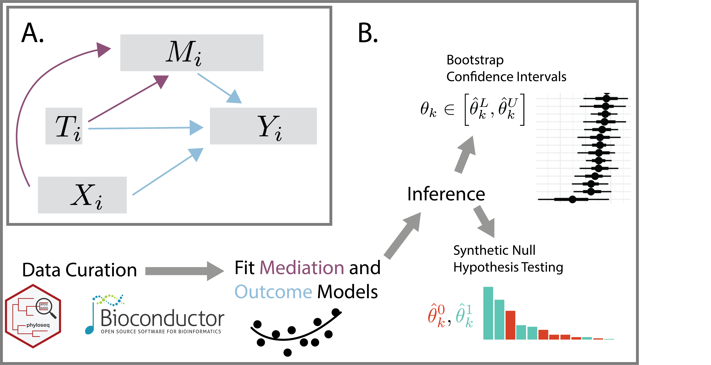
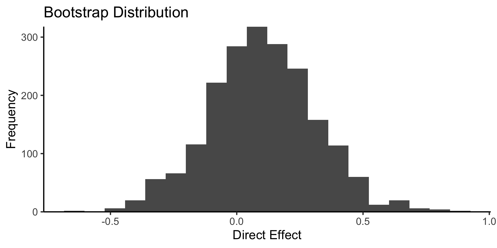

# multimedia 

<!-- badges: start -->

<!-- badges: end -->

`multimedia` is an R package for **multi**modal **media**tion analysis
of microbiome data. It streamlines data curation, mediation and outcome
model specification, and statistical inference for direct and indirect
effects. By defining causal relationships across data modalities, it can
support principled data integration. You can read more about the package
in our preprint:

[H. Jiang, X. Miao, M. W. Thairu, M. Beebe, D. W. Grupe, R. J. Davidson,
J. Handelsman, and K. Sankaran (2024). multimedia: Multimodal Mediation
Analysis of Microbiome
Data.](https://www.biorxiv.org/content/10.1101/2024.03.27.587024v1)

The preprint describes the scientific context and interpretation for two
of the vignettes in this package. One gives a multi-omics analysis of
IBD, and the other describes how to simultaneously model 16S profiles
and survey responses in a mindfulness intervention study.

## Installation

You can install the development version from
[GitHub](https://github.com/krisrs1128/multimedia) with:

    # install.packages("devtools")
    devtools::install_github("krisrs1128/multimedia")

## Example

Here is a simple example of estimating direct and indirect effects. The
data are randomly generated (no real effects), but we imagine that the
ASV columns mediate the relationship between `treatment` and `PHQ`. This
is mimics the possibility that the microbiome (ASV = Amplicon Sequence
Variant) mediates the relationship between a treatment and depression
(PHQ = Patient Health Questionnaire). You can find more details in the
`random.Rmd` vignette.

The original data here are a `SummarizedExperiment`. The package can
also take phyloseq objects and data.frames.

    library(multimedia)
    demo_joy()

<pre class="r-output"><code>## class: SummarizedExperiment 
## dim: 5 100 
## metadata(0):
## assays(1): counts
## rownames(5): ASV1 ASV2 ASV3 ASV4 ASV5
## rowData names(0):
## colnames: NULL
## colData names(2): treatment PHQ
</code></pre>

Next, we specify which columns are the treatment, mediators, and
outcomes. Notice that we can use `tidyselect` syntax to match multiple
columns.

    exper <- mediation_data(demo_joy(), "PHQ", "treatment", starts_with("ASV"))
    exper

<pre class="r-output"><code>## [Mediation Data] 
## 100 samples with measurements for, 
## 1 treatment: treatment 
## 5 mediators: ASV1, ASV2, ... 
## 1 outcome: PHQ
</code></pre>

Next, we fit all mediation analysis components and estimate effects. By
default, the package uses linear models – see the vignettes for examples
using sparse regression, random forests, and bayesian hierarchical
models instead.

    model <- multimedia(exper) |>
        estimate(exper)
    model

<pre class="r-output"><code>## [Multimedia Analysis] 
## Treatments: treatment 
## Outcomes: PHQ 
## Mediators: ASV1, ASV2, ... 
##   
## [Models] 
## mediation: A fitted lm_model(). 
## outcome: A fitted lm_model().
</code></pre>

In any mediation analysis, there are several types of effects that could
be interesting, each corresponding to different ways of traveling from
the treatment to the outcome in the mediation analysis causal graph. In
the block below, `direct_effect` captures treatment effects that bypass
the microbiome; `indirect_effect` are effects that are mediated by ASV
relative abundances. Since this example uses a linear model, the effects
are identical for the two indirect settings.

    direct_effect(model, exper)

<pre class="r-output"><code>##   outcome indirect_setting
## 1     PHQ          Control
## 2     PHQ        Treatment
##              contrast direct_effect
## 1 Control - Treatment    0.09314376
## 2 Control - Treatment    0.09314376
</code></pre>

    indirect_overall(model, exper)

<pre class="r-output"><code>##   outcome direct_setting            contrast
## 1     PHQ        Control Control - Treatment
## 2     PHQ      Treatment Control - Treatment
##   indirect_effect
## 1      0.02256029
## 2      0.02256029
</code></pre>

The package also includes helpers to visualize and perform inference on
these effects. For example,

    boot <- bootstrap(model, exper, c(direct = direct_effect))

    library(ggplot2)
    ggplot(boot$direct) +
        geom_histogram(aes(direct_effect), bins = 20) +
        scale_y_continuous(expand = c(0, 0)) +
        theme_classic() +
        labs(x = "Direct Effect", y = "Frequency", title = "Bootstrap Distribution")

If we want to use a different type of model, we can just modify the
original `multimedia` specification. Below we use a sparse regression
model, which correctly recovers that the direct effects are 0.

    multimedia(exper, glmnet_model(lambda = .1)) |>
        estimate(exper) |>
        direct_effect()

<pre class="r-output"><code>##   outcome indirect_setting
## 1     PHQ          Control
## 2     PHQ        Treatment
##              contrast direct_effect
## 1 Control - Treatment             0
## 2 Control - Treatment             0
</code></pre>

## Help

We welcome questions and comments about the package either through
[github](https://github.com/krisrs1128/multimedia/issues) or
[email](mailto:ksankaran@wisc.edu).

    sessionInfo()

<pre class="r-output"><code>## R version 4.4.1 Patched (2024-08-21 r87049)
## Platform: aarch64-apple-darwin20
## Running under: macOS Sonoma 14.5
## 
## Matrix products: default
## BLAS:   /Library/Frameworks/R.framework/Versions/4.4-arm64/Resources/lib/libRblas.0.dylib 
## LAPACK: /Library/Frameworks/R.framework/Versions/4.4-arm64/Resources/lib/libRlapack.dylib;  LAPACK version 3.12.0
## 
## locale:
## [1] en_US.UTF-8/en_US.UTF-8/en_US.UTF-8/C/en_US.UTF-8/en_US.UTF-8
## 
## time zone: America/Chicago
## tzcode source: internal
## 
## attached base packages:
## [1] stats     graphics  grDevices utils    
## [5] datasets  methods   base     
## 
## other attached packages:
## [1] ggplot2_3.5.1     multimedia_0.2.0 
## [3] tidyselect_1.2.1  ranger_0.16.0    
## [5] glmnetUtils_1.1.9 brms_2.21.0      
## [7] Rcpp_1.0.13      
## 
## loaded via a namespace (and not attached):
##   [1] gridExtra_2.3              
##   [2] inline_0.3.19              
##   [3] permute_0.9-7              
##   [4] sandwich_3.1-0             
##   [5] rlang_1.1.4                
##   [6] magrittr_2.0.3             
##   [7] multcomp_1.4-26            
##   [8] ade4_1.7-22                
##   [9] matrixStats_1.4.1          
##  [10] compiler_4.4.1             
##  [11] mgcv_1.9-1                 
##  [12] loo_2.8.0                  
##  [13] vctrs_0.6.5                
##  [14] reshape2_1.4.4             
##  [15] stringr_1.5.1              
##  [16] pkgconfig_2.0.3            
##  [17] shape_1.4.6.1              
##  [18] crayon_1.5.3               
##  [19] fastmap_1.2.0              
##  [20] backports_1.5.0            
##  [21] XVector_0.45.0             
##  [22] labeling_0.4.3             
##  [23] utf8_1.2.4                 
##  [24] rmarkdown_2.28             
##  [25] UCSC.utils_1.1.0           
##  [26] purrr_1.0.2                
##  [27] xfun_0.47                  
##  [28] glmnet_4.1-8               
##  [29] zlibbioc_1.51.1            
##  [30] GenomeInfoDb_1.41.1        
##  [31] jsonlite_1.8.8             
##  [32] progress_1.2.3             
##  [33] biomformat_1.33.0          
##  [34] highr_0.11                 
##  [35] rhdf5filters_1.17.0        
##  [36] DelayedArray_0.31.11       
##  [37] Rhdf5lib_1.27.0            
##  [38] prettyunits_1.2.0          
##  [39] cluster_2.1.6              
##  [40] parallel_4.4.1             
##  [41] R6_2.5.1                   
##  [42] stringi_1.8.4              
##  [43] StanHeaders_2.32.10        
##  [44] GenomicRanges_1.57.1       
##  [45] estimability_1.5.1         
##  [46] rstan_2.32.6               
##  [47] SummarizedExperiment_1.35.1
##  [48] iterators_1.0.14           
##  [49] knitr_1.48                 
##  [50] zoo_1.8-12                 
##  [51] IRanges_2.39.2             
##  [52] bayesplot_1.11.1           
##  [53] igraph_2.0.3               
##  [54] Matrix_1.7-0               
##  [55] splines_4.4.1              
##  [56] abind_1.4-5                
##  [57] yaml_2.3.10                
##  [58] vegan_2.6-8                
##  [59] codetools_0.2-20           
##  [60] curl_5.2.2                 
##  [61] pkgbuild_1.4.4             
##  [62] lattice_0.22-6             
##  [63] tibble_3.2.1               
##  [64] plyr_1.8.9                 
##  [65] withr_3.0.1                
##  [66] Biobase_2.65.1             
##  [67] bridgesampling_1.1-2       
##  [68] posterior_1.6.0            
##  [69] coda_0.19-4.1              
##  [70] evaluate_0.24.0            
##  [71] survival_3.7-0             
##  [72] RcppParallel_5.1.9         
##  [73] Biostrings_2.73.1          
##  [74] pillar_1.9.0               
##  [75] phyloseq_1.49.0            
##  [76] MatrixGenerics_1.17.0      
##  [77] tensorA_0.36.2.1           
##  [78] checkmate_2.3.2            
##  [79] foreach_1.5.2              
##  [80] stats4_4.4.1               
##  [81] distributional_0.4.0       
##  [82] generics_0.1.3             
##  [83] hms_1.1.3                  
##  [84] S4Vectors_0.43.2           
##  [85] rstantools_2.4.0           
##  [86] munsell_0.5.1              
##  [87] scales_1.3.0               
##  [88] xtable_1.8-4               
##  [89] glue_1.7.0                 
##  [90] emmeans_1.10.4             
##  [91] tools_4.4.1                
##  [92] data.table_1.16.0          
##  [93] mvtnorm_1.3-1              
##  [94] tidygraph_1.3.1            
##  [95] rhdf5_2.49.0               
##  [96] grid_4.4.1                 
##  [97] tidyr_1.3.1                
##  [98] ape_5.8                    
##  [99] QuickJSR_1.3.1             
## [100] miniLNM_0.1.0              
## [101] colorspace_2.1-1           
## [102] nlme_3.1-166               
## [103] formula.tools_1.7.1        
## [104] GenomeInfoDbData_1.2.12    
## [105] patchwork_1.2.0            
## [106] cli_3.6.3                  
## [107] fansi_1.0.6                
## [108] S4Arrays_1.5.7             
## [109] Brobdingnag_1.2-9          
## [110] dplyr_1.1.4                
## [111] V8_5.0.0                   
## [112] gtable_0.3.5               
## [113] digest_0.6.37              
## [114] operator.tools_1.6.3       
## [115] BiocGenerics_0.51.1        
## [116] SparseArray_1.5.31         
## [117] TH.data_1.1-2              
## [118] farver_2.1.2               
## [119] multtest_2.61.0            
## [120] htmltools_0.5.8.1          
## [121] lifecycle_1.0.4            
## [122] httr_1.4.7                 
## [123] MASS_7.3-61
</code></pre>
